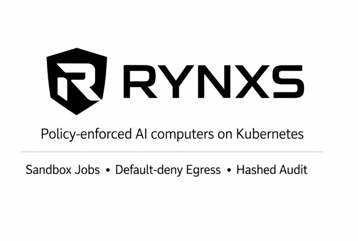

## Branch guide

- main: full Kubernetes architecture (operator + sandbox + policy enforcement)
- proof-lite: minimal deterministic runtime (no external dependencies)
- production-arch: enterprise sandbox development lane (gVisor/Kata, policy packs, signed images, immutable audit)

<p align="center">
  
</p>

# Rynxs: Policy-Enforced Multi-AI Worker and "AI Computers" Platform on Kubernetes

Rynxs is a Kubernetes-native platform designed to orchestrate large-scale AI agents by providing them with "AI Computers"—controlled workspaces, tools, and sandboxed execution environments—governed by strict policy enforcement and deterministic control loops.

Rather than a simple multi-worker queue, Rynxs treats agent behavior as a governable resource, leveraging the Kubernetes operator pattern to reconcile desired safety states with actual agent execution.

---

## Technical Pillars

- **Policy-Enforced AI Computers**: Agents operate within a strictly governed environment including filesystems, shells, and network access.
- **Sandboxed Execution**: High-risk tools (e.g., shell commands) are executed as isolated Kubernetes Jobs, preventing host-level access and ensuring run-to-completion semantics.
- **Default-Deny Egress**: L3/L4 network isolation via NetworkPolicy (requires CNI enforcement) ensure agents only communicate with approved endpoints.
- **Deterministic Proof (The Universe Model)**: Core dynamics like social sharding, zonal physics jitter, and health-based sleep cycles are reconciled through a deterministic control plane.
- **Immutable Audit Trail**: Every tool invocation is recorded in an append-only `/workspace/audit.jsonl` with hashed arguments and outputs for cryptographic verification.

---

## High-Level Architecture

### Control Plane (Management)
- **Operator (CRD + Reconciler)**: Watches `Agent` and `Universe` CRDs to automatically provision Deployments, PVCs, RBAC roles, and NetworkPolicies.
- **Management API/UI**: Interface for policy definition, tenant isolation, and fleet rollouts.

### Data Plane (Execution)
- **Agent Runtime**: The core loop managing tool invocation, policy checks, and workspace management.
- **Sandbox Jobs**: Hardened, short-lived Jobs for shell/browser execution with automated TTL cleanup.
- **Model Ingress**: Support for local or cloud-based inference endpoints (OAI-compat).

### State Layer
- **Workspace (PVC)**: Persistent local storage for agent files and [audit traces](docs/audit.md).
- **Deterministic Memory**: Implementation of RAM (volatile), Volume (persistent), and Bucket (atomic snapshots) [invariants](docs/universe-model.md).

---

## Quickstart (3-minute proof)

### 1) Install CRDs + base stack
```bash
kubectl apply -f crds/
kubectl apply -k deploy/kustomize/base
kubectl apply -f docs/examples/universe.yaml
kubectl apply -f docs/examples/agent.yaml
```

### 2) Find the agent pod (namespace-agnostic)

```bash
POD=$(kubectl get pods -A -l app=rynxs-agent -o jsonpath='{.items[0].metadata.name}')
NS=$(kubectl get pods -A -l app=rynxs-agent -o jsonpath='{.items[0].metadata.namespace}')
echo "Agent pod: $NS/$POD"
```

### 3) Send a task (via workspace inbox)

```bash
kubectl exec -n "$NS" "$POD" -- sh -lc 'echo "{\"text\":\"run uname -a in sandbox\"}" >> /workspace/inbox.jsonl'
kubectl logs -n "$NS" "$POD" -f
```

### 4) Proof: sandbox job + audit + outbox

```bash
kubectl get jobs -n "$NS" | grep sandbox-shell || true
kubectl exec -n "$NS" "$POD" -- sh -lc 'tail -n 3 /workspace/audit.jsonl'
kubectl exec -n "$NS" "$POD" -- sh -lc 'tail -n 1 /workspace/outbox.jsonl | head -c 800 && echo'
```

**Expected Results:**
- A Job named `sandbox-shell-<agent>-<suffix>` appears.
- `audit.jsonl` contains a `sandbox_job` reference with SHA-256 tool metadata.
- `outbox.jsonl` contains the verified execution output.

---

## Safety and Compliance Baseline

Rynxs implements the following security defaults for all workloads:
- `runAsNonRoot`: Containers never run as root.
- `readOnlyRootFilesystem`: Agent root is immutable.
- `allowPrivilegeEscalation: false`: Limits the attack surface for container breakout.
- `drop: ["ALL"]`: Minimum capability set.
- `RuntimeClass`: Recommended support for [gVisor](https://gvisor.dev/docs/user_guide/quick_start/kubernetes/) or [Kata](https://katacontainers.io/) for stronger isolation.
- `Pod Security Admission`: Namespace-level enforcement of [baseline/restricted profiles](https://kubernetes.io/docs/concepts/security/pod-security-standards/).

---

## Roadmap

- **Multi-Channel Gateway**: WebSocket and API integration for external triggers (Slack, Telegram, Web).
- **Advanced Sandbox Hardening**: Built-in support for gVisor/Kata profiles and automated NetworkPolicy generation.
- **Phase 3 (Travel)**: Cross-universe travel sessions with filtered memory bridging.
- **SIEM Integration**: Automated audit ingestion via OTel or Fluent Bit for immutable storage.

---

## References

- [Kubernetes Operator Pattern](https://kubernetes.io/docs/concepts/extend-kubernetes/operator/)
- [Sandboxed Runtimes (gVisor)](https://gvisor.dev/docs/user_guide/quick_start/kubernetes/)
- [Job TTL Cleanup](https://kubernetes.io/docs/concepts/workloads/controllers/ttlafterfinished/)
- [Network Isolation via NetworkPolicy](https://kubernetes.io/docs/concepts/services-networking/network-policies/)

---

## License

Apache-2.0
