# Rynxs — Governed AI Computers on Kubernetes

[](https://opensource.org/licenses/Apache-2.0)
[](https://kubernetes.io/)
[](docs/PRODUCTION_CHECKLIST.md)

> **Production-ready Kubernetes platform for running governed "AI computers"** — agents with real capabilities (workspace, shell, browser) but with auditability, safety, and operational control.

Rynxs combines **event-sourced state management**, **leader election**, **S3-backed durable logs**, and **production-grade observability** to deliver a platform you can actually run in production.

This isn't "magic guarantees" — it's **mitigated, observable, and forensically analyzable** reliability aligned with distributed systems reality.

---

## Quick Install (60 seconds)



```bash
# Production deployment with HA
helm install rynxs ./helm/rynxs -n rynxs --create-namespace -f helm/rynxs/values-production.yaml

# Verify installation
kubectl get pods -n rynxs -l app.kubernetes.io/name=rynxs
```

See [`docs/PRODUCTION_CHECKLIST.md`](docs/PRODUCTION_CHECKLIST.md) for full go-live validation (10 steps + 2-minute smoke test).

---

## What is Rynxs?

**The problem:**
AI agents need "computer capabilities" (shell, file system, browser, tools) to be useful. But giving unrestricted access is dangerous:
- Agents can corrupt data, leak secrets, consume unlimited resources
- Multiple agents can conflict with each other
- Debugging agent behavior is nearly impossible without audit trails

**Rynxs solves this:**
A Kubernetes-native platform that gives agents **governed computer capabilities**:
- ✅ Agents get workspaces, tools, and sandboxed execution environments
- ✅ Every action is recorded in an **immutable, hash-chained audit log**
- ✅ Policies enforce isolation, resource limits, and network access controls
- ✅ Operations teams can observe, debug, and control the system with **metrics, alerts, and runbooks**

**In one sentence:**
Rynxs = "AI computers" with governance, auditability, and operational safety.

---

## Key Capabilities

### Production-Ready Infrastructure
- **One-command deployment** — Helm chart with production defaults, least-privilege RBAC, documented lifecycle
- **High availability** — Multi-replica operator with Kubernetes Lease leader election and tested failover
- **Durable event log** — S3/MinIO append-only storage with hash-chain integrity and tamper detection
- **Production observability** — Prometheus metrics, critical alerts with runbooks, structured JSON logs

### Security & Governance
- **Policy-enforced execution** — Default-deny networking, sandboxed jobs (gVisor/Kata support)
- **Immutable audit trail** — Dual-layer: workspace-level traces + S3-backed event log (hash-chained)
- **Forensic traceability** — Fencing tokens, split-brain detection, post-mortem analysis tools
- **Compliance baseline** — Non-root containers, read-only root FS, Pod Security Admission

### Operational Safety
- **Controlled risk posture** — No "magic guarantees"; split-brain is **mitigated** and **forensically analyzable**
- **Go-live checklist** — 10-step validation + 2-minute smoke test
- **Alerts + runbooks** — RynxsNoLeader, RynxsLeaderFlap, RynxsEventStoreErrorsHigh, and more
- **S3 enforcement** — Bucket policy with conditional writes (If-None-Match) prevents log corruption

---

## Architecture Overview

Rynxs uses a **Kubernetes operator pattern** with **event-sourced state management**:

### Control Plane
- **Operator** watches `Agent` and `Universe` CRDs
- **Event-sourced reconciliation** with append-only log (every state change is an event)
- **Leader election** for HA (Kubernetes Lease API)
- **S3/MinIO durable storage** with hash-chain integrity

### Execution Plane
- **Agent runtime** with workspace + dual audit trail:
  - Workspace-level traces (`/workspace/audit.jsonl`)
  - S3-backed event log (hash-chained, for HA and forensic integrity)
- **Sandboxed jobs** for shell/browser execution (Kubernetes Jobs with TTL cleanup)
- **Default-deny networking** (NetworkPolicy)
- **Optional gVisor/Kata** runtime isolation

### Security Defaults
- Non-root containers (`runAsNonRoot: true`)
- Read-only root filesystem
- No privilege escalation (`allowPrivilegeEscalation: false`)
- Minimal capabilities (`drop: ["ALL"]`)
- Pod Security Admission (baseline/restricted profiles)

**Learn more:** [`docs/PRIMER.md`](docs/PRIMER.md) explains the system from first principles.

---

## Quick Start

### Agent Execution Demo


### Step 1: Install Rynxs

**Production (Helm - recommended):**
```bash
helm install rynxs ./helm/rynxs -n rynxs --create-namespace -f helm/rynxs/values-production.yaml
```

**Development (Kustomize):**
```bash
kubectl apply -f crds/
kubectl apply -k deploy/kustomize/base
```

### Step 2: Create an Agent

```bash
kubectl apply -f - <<EOF
apiVersion: universe.ai/v1alpha1
kind: Agent
metadata:
  name: my-agent
  namespace: rynxs
spec:
  role: sandbox
  image: python:3.11-slim
  resources:
    requests:
      memory: "256Mi"
      cpu: "100m"
EOF
```

### Step 3: Verify Agent is Running

```bash
kubectl get pods -n rynxs -l app=universe-agent
# NAME            READY   STATUS    AGE
# my-agent-0      1/1     Running   10s
```

### Step 4: Send a Task

```bash
POD=$(kubectl get pods -n rynxs -l app=universe-agent -o jsonpath='{.items[0].metadata.name}')

kubectl exec -n rynxs $POD -- sh -c 'echo "{\"text\":\"run uname -a in sandbox\"}" >> /workspace/inbox.jsonl'
```

### Step 5: Verify Sandbox Job + Audit Trail

```bash
# Check sandbox job was created
kubectl get jobs -n rynxs | grep sandbox-shell

# Verify audit trail (hash-chained)
kubectl exec -n rynxs $POD -- tail -3 /workspace/audit.jsonl

# Check output
kubectl exec -n rynxs $POD -- tail -1 /workspace/outbox.jsonl
```

**Expected:** Sandbox job completes, audit trail contains hash-chained event, output appears in outbox.

---

## Production Readiness



Rynxs has been hardened and validated for **production deployment** with focus on **HA, durability, observability, and controlled risk**.

### What this proves (in plain terms)

- ✅ **Deployable**: Single-command install via Helm (no manual YAML orchestration)
- ✅ **HA (High Availability)**: Multi-replica operator with Kubernetes Lease leader election + failover validation
- ✅ **Durable state**: Append-only event log in **S3/MinIO**, with hash-chain integrity checks
- ✅ **Observable operations**: Prometheus metrics + critical alerts + runbooks for incident response
- ✅ **Controlled risk posture**: No "magic guarantees"; split-brain is **mitigated** and **forensically analyzable**

### Start Here (Go-Live)

- **Go-live gate / validation checklist:** [`docs/PRODUCTION_CHECKLIST.md`](docs/PRODUCTION_CHECKLIST.md)
- **Alerts + runbooks:** [`docs/PROMETHEUS_ALERTS.md`](docs/PROMETHEUS_ALERTS.md)
- **S3 conditional write enforcement:** [`docs/S3_BUCKET_POLICY.md`](docs/S3_BUCKET_POLICY.md)

### Timeline (How We Got Here)

- **Milestone changelog:** [`docs/MILESTONE_CHANGELOG.md`](docs/MILESTONE_CHANGELOG.md)
- **Exec summary:** [`docs/EXECUTIVE_SUMMARY.md`](docs/EXECUTIVE_SUMMARY.md)
- **Release notes & sign-off:** [`docs/RELEASE_NOTES.md`](docs/RELEASE_NOTES.md), [`docs/RELEASE_SIGNOFF.md`](docs/RELEASE_SIGNOFF.md)

---

## Branch Guide

Rynxs development is organized across multiple branches, each serving a specific purpose:

### `main` — Full Kubernetes Architecture
**Purpose:** Stable, production-track branch with complete Kubernetes operator implementation

**What's included:**
- Kubernetes operator (CRD + reconciler)
- Sandboxed execution (Kubernetes Jobs)
- Policy enforcement (NetworkPolicy, RBAC)
- Workspace management (PVC + audit trails)
- Default-deny networking

**Use case:** Deploy Rynxs with full Kubernetes orchestration and policy enforcement

**Status:** Stable, recommended for evaluation and development

---

### `evo/deterministic-engine-v2` — Production Hardening ⭐ **SHIP READY**
**Purpose:** Production-ready branch with HA, S3 event log, observability, and hardening

**What's included (on top of `main`):**
- ✅ **Helm chart** (one-command deploy, production values)
- ✅ **HA leader election** (Kubernetes Lease + failover tests)
- ✅ **S3 event store** (append-only, hash-chain, MinIO support)
- ✅ **Observability** (Prometheus metrics, alerts, runbooks, structured logs)
- ✅ **Production hardening** (split-brain mitigations, topology spread, PDB, metric drift fix)
- ✅ **Go-live checklist** (10-step validation + 2-minute smoke test)

**Use case:** Deploy to production with HA, durability, and operational safety

**Status:** **SHIP READY** — All production blockers closed, release docs complete

**Documentation:**
- [`docs/PRODUCTION_CHECKLIST.md`](docs/PRODUCTION_CHECKLIST.md) — Go-live validation
- [`docs/MILESTONE_CHANGELOG.md`](docs/MILESTONE_CHANGELOG.md) — Evolution timeline (E1→E4→E2→E3→Hardening)

---

### `proof-lite` — Minimal Deterministic Runtime
**Purpose:** Standalone deterministic execution engine without Kubernetes dependencies

**What's included:**
- Event-sourced state machine (no K8s API)
- Hash-chain integrity validation
- Deterministic replay from event log
- CLI tooling for inspection and audit

**Use case:**
- Understand event sourcing without Kubernetes complexity
- Embed deterministic runtime in non-K8s environments
- Research and academic validation of determinism model

**Status:** Experimental, for research and education

---

### `production-arch` — Enterprise Sandbox Development Lane
**Purpose:** Advanced sandbox hardening and enterprise features (under development)

**What's being developed:**
- gVisor/Kata Containers runtime class integration
- Policy packs (egress control templates, runtime profiles)
- Signed container images (Sigstore/Cosign)
- Enhanced audit trails (SIEM integration, OTel)
- Immutable infrastructure patterns

**Use case:** Enterprise deployments requiring highest security posture (fintech, gov, regulated industries)

**Status:** Development lane — features graduate to `main` when stable

---

## Documentation

### Getting Started
- [`docs/PRIMER.md`](docs/PRIMER.md) — **START HERE** if new to Rynxs (explains from zero)
- [`docs/PRODUCTION_CHECKLIST.md`](docs/PRODUCTION_CHECKLIST.md) — Go-live validation (10 steps + 2 min smoke test)
- [`docs/MILESTONE_CHANGELOG.md`](docs/MILESTONE_CHANGELOG.md) — Production evolution timeline
- [`helm/rynxs/README.md`](helm/rynxs/README.md) — Helm chart usage and configuration

### Operations
- [`docs/PROMETHEUS_ALERTS.md`](docs/PROMETHEUS_ALERTS.md) — Alerts and runbooks
- [`docs/S3_BUCKET_POLICY.md`](docs/S3_BUCKET_POLICY.md) — S3 conditional write enforcement
- [`docs/RBAC.md`](docs/RBAC.md) — RBAC permissions documentation

### Release & Technical Overview
- [`docs/RELEASE_NOTES.md`](docs/RELEASE_NOTES.md) — Public release notes
- [`docs/RELEASE_SIGNOFF.md`](docs/RELEASE_SIGNOFF.md) — Internal ops sign-off
- [`docs/EXECUTIVE_SUMMARY.md`](docs/EXECUTIVE_SUMMARY.md) — Technical executive overview

---

## Roadmap

### Near-term (Q1 2026)
- [ ] Multi-channel gateway (WebSocket, Slack, Telegram integration)
- [ ] Advanced NetworkPolicy automation (per-agent egress rules)
- [ ] S3 Object Lock (WORM) compliance mode

### Mid-term (Q2-Q3 2026)
- [ ] gVisor/Kata runtime class profiles
- [ ] Policy packs (pre-configured security templates)
- [ ] SIEM integration (OTel, Fluent Bit)

### Long-term (Q4 2026+)
- [ ] Cross-universe travel sessions (Phase 3)
- [ ] Deterministic replay CLI (time-travel debugging)
- [ ] Multi-tenant isolation (namespace-per-tenant)

---

## Contributing

We welcome contributions! See [`CONTRIBUTING.md`](CONTRIBUTING.md) for development workflow and guidelines.

**Key areas:**
- Production hardening (split-brain edge cases, failure modes)
- Observability (new metrics, alert definitions)
- Security (sandbox escape prevention, audit improvements)
- Documentation (runbooks, operational guides)

---

## References

- [Kubernetes Operator Pattern](https://kubernetes.io/docs/concepts/extend-kubernetes/operator/)
- [Sandboxed Runtimes (gVisor)](https://gvisor.dev/docs/user_guide/quick_start/kubernetes/)
- [Event Sourcing Pattern](https://martinfowler.com/eaaDev/EventSourcing.html)
- [Network Policies](https://kubernetes.io/docs/concepts/services-networking/network-policies/)
- [Pod Security Standards](https://kubernetes.io/docs/concepts/security/pod-security-standards/)

---

## License

Apache-2.0 — See [LICENSE](LICENSE) for details.

---

## Support

- **Issues:** [GitHub Issues](https://github.com/Uhudsavasindankacanokcu2/rynxs-agentos/issues)
- **Discussions:** [GitHub Discussions](https://github.com/Uhudsavasindankacanokcu2/rynxs-agentos/discussions)
- **Documentation:** Start with [`docs/PRIMER.md`](docs/PRIMER.md)
