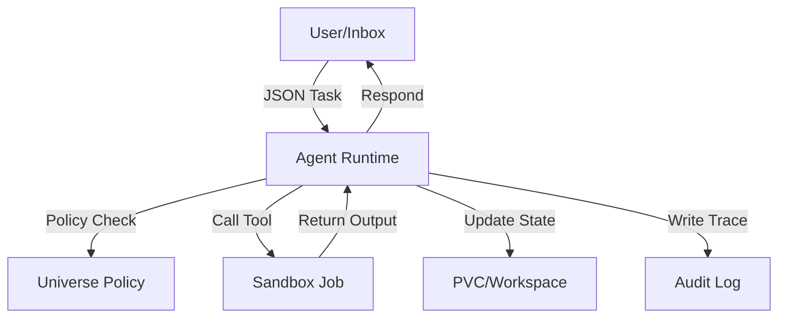

# Rynxs Architecture Overview

Rynxs implements a "governable AI worker" platform using the Kubernetes Operator pattern. It separates the orchestration of agents from their execution and state persistence.

## Model Components

### 1. Control Plane (Kubernetes Operator)
The Rynxs Operator watches for `Agent` custom resources. When an agent is created, the operator reconciles the following:
- **Deployment**: The agent runtime which contains the core reasoning loop.
- **PVC**: The agent's dedicated workspace for persistent memory and file staging.
- **RBAC**: A ServiceAccount and Role allowing the agent to create Job resources (for sandboxes) and read their logs.
- **NetworkPolicy**: Per-agent egress/ingress rules.

### 2. Worker Plane (Agent Runtime)
The runtime pod is the "consciousness" of the agent. It:
- **Observes**: Watches `inbox.jsonl` for tasks.
- **reasons**: Selects tools based on the model's plan.
- **Enforces**: Checks tool calls against the allowlist and current policy state (e.g., physics jitter, luck).
- **Logs**: Writes the `audit.jsonl` trace and `outbox.jsonl` results.

### 3. Sandbox Plane (Isolated Tasks)
Tasks that require shell access or long-running computations are launched as separate Pods via the Batch API (Jobs).
- **Isolation**: Prevents memory/CP-leakage between tools and the main runtime.
- **Scalability**: Decouples heavy tool execution from the agent's main loop.

## The Universe Model (The Policy Engine)
Rynxs can optionally incorporate the "Universe Model" primitives to govern behavior over time:
- **Social Sharding**: Agents belong to weighted "zones" (Family, Work, Community), affecting their behavior and physics jitter.
- **Physics Jitter ($\epsilon$)**: Slow drift in environment rules, making the simulation feel alive.
- **Luck Controller**: Controlled variability for non-deterministic events, auditable via the luck rate.
- **Sleep Cycles**: Health-based fragmentation metrics trigger mandatory snapshots (Deep Sleep) or cache flushes (Light Sleep).

## Information Flow

